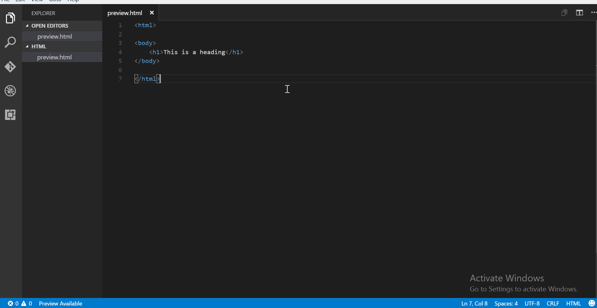
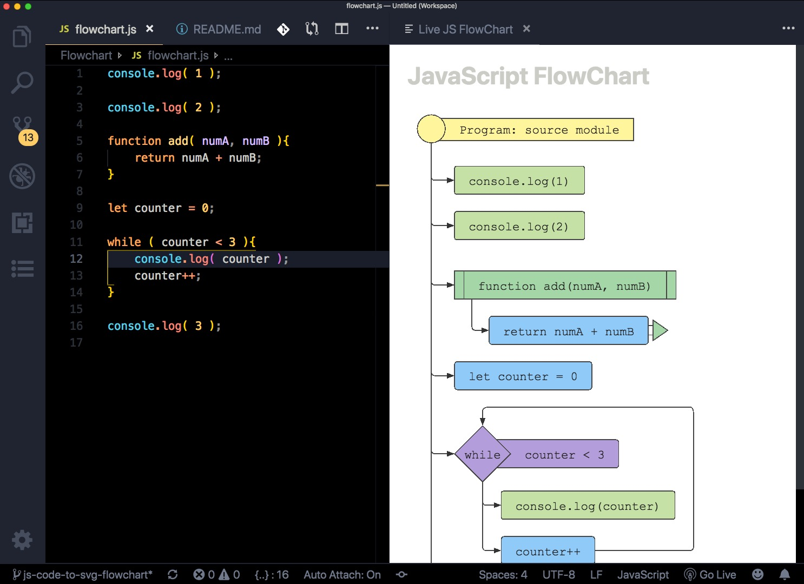

# Live HTML & JS Previewer v2
#### *(Version: 0.1.8)*
This extension allows you to:
- Preview your html files in VS Code itself. Use it to quickly set the html and css right for your webpages.
- Preview a [Flowchart](https://github.com/Bogdan-Lyashenko/js-code-to-svg-flowchart/) for your JavaScript code

## IMPORTANT: This extension is based on the [Live HTML Previewer](https://github.com/HarshdeepGupta/live-html-preview) VSCode extension by [Harshdeep Gupta](https://github.com/HarshdeepGupta) and [js2flowchart](https://github.com/Bogdan-Lyashenko/js-code-to-svg-flowchart) by [Bohdan Liashenko](https://github.com/Bogdan-Lyashenko)

**Important:** If you like this plugin don't forget to Star the authors' repositories.
 
### Features
#### Side preview with live editing

#### Full page preview
#### Open html file in browser
#### Show JavaScript FlowChart

[YouTube Demo](https://www.youtube.com/embed/05eYKgmmHXY)

### Usage
* For side preview, use the keybinding 'ctrl+q s' or press 'F1' and type "Show side HTML preview"
* For full preview, use the keybinding 'ctrl+q f' or press 'F1' and type "Show full HTML preview"
* To open file in browser: 
    * use the keybinding 'ctrl+q w' or
    * press 'F1' and type "Open in browser" or
    * right click in the editor/side bar, select "Open in browser"

If a HTML file is open, a message is displayed on the Status Bar in bottom left. Click on it for side preview.
* For side preview of JavaScript Flowchart, use the keybinding 'ctrl+q c' or press 'F1' and type "Show JS FlowChart"

### Development

    Clone repo

    `$ npm install`
    `$ npm run compile`

### TODO / WORK IN PROGRESS

- Add support for local resources loaded via link tags (CSS files), img tags, etc. Right now only remote resources (CSS, images, js) are supported on an HTML page.